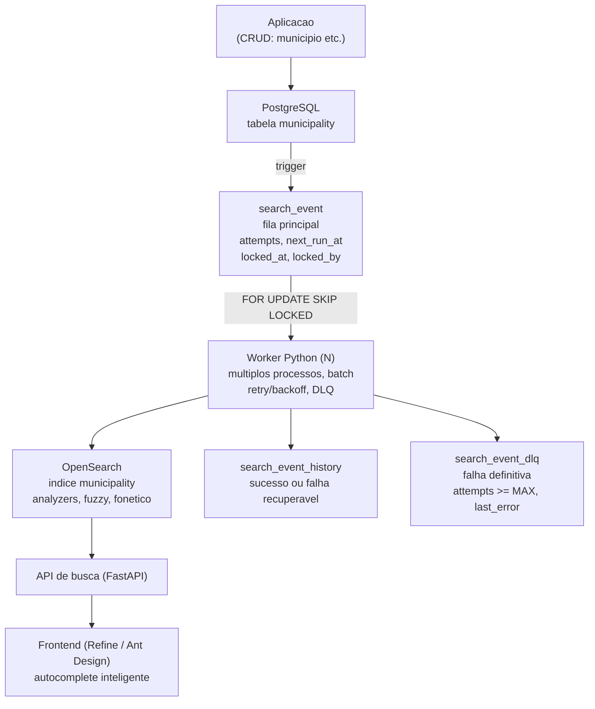

# Decisoes Arquiteturais

Registro das decisoes tecnicas que orientam a implementacao da plataforma Agenda. Este documento registra limites e contratos arquiteturais; requisitos de produto e regras de negocio permanecem no [BUSINESS_MODEL.md](BUSINESS_MODEL.md).

## Status

- **Data da primeira versao:** 2026-09-11
- **Estado:** em definicao tecnica
- **Escopo:** MVP

## Decisoes confirmadas

### 0. Convencao de nomes tecnicos

Todos os nomes tecnicos do sistema devem ser escritos em ingles, incluindo:

- entidades e objetos de dominio;
- tabelas, colunas, indices e constraints do banco;
- nomes de relacionamentos e chaves estrangeiras;
- repositorios, casos de uso, ports, adapters e contratos internos.

Textos exibidos ao usuario podem permanecer em portugues. Essa separacao evita
misturar linguagem de interface com nomenclatura tecnica e deve ser aplicada a
todo novo modulo, migration ou endpoint interno.

#### 0.1 Entidade polimorfica de identidade

A identidade persistente sera modelada por uma hierarquia polimorfica SQLAlchemy
com `BaseUser` como entidade-base e `Person` e `Company` como entidades derivadas.
Todas as tabelas do banco devem usar nome em ingles, singular e caixa baixa.
Portanto, a tabela-base deve ser `base_user`, e as tabelas derivadas
devem ser `person` e `company`.

O discriminador da heranca fica em `base_user.person_type`. A configuracao conceitual
da hierarquia e:

```python
class BaseUser(Base):
	__tablename__ = "base_user"
	name: Mapped[str] = mapped_column(String(255))
	nickname: Mapped[str] = mapped_column(String(255))
	birth_date: Mapped[date] = mapped_column(Date)
	__mapper_args__ = {
		"polymorphic_on": "person_type",
		"polymorphic_identity": "base_user",
	}


class Person(BaseUser):
	__tablename__ = "person"
	cpf: Mapped[str] = mapped_column(String)
	__mapper_args__ = {
		"polymorphic_identity": PersonType.PERSON.value,
	}


class Company(BaseUser):
	__tablename__ = "company"
	cnpj: Mapped[str] = mapped_column(String)
	__mapper_args__ = {
		"polymorphic_identity": PersonType.COMPANY.value,
	}
```

`Person` e `Company` devem usar heranca de tabela unida, com a chave primaria
da tabela derivada referenciando `base_user.id`. O valor-base `base_user` identifica a
entidade-raiz; os valores `PersonType.PERSON.value` e
`PersonType.COMPANY.value` identificam as entidades concretas.

#### 0.2 Catalogos simples

Catalogos simples que representem tipos ou opcoes devem usar somente uma chave
primaria UUIDv7 `id` e uma `description` textual. A `description` deve ser
unica no banco; nao criar um campo `code` separado quando o `id` ja identifica o
registro. Novas categorias devem ser adicionadas como registros, nao como enum
fixo em Python.

Nos modelos de negocio, os campos devem ser opcionais por padrao quando a
regra nao exigir preenchimento. `BaseUser.name` e obrigatorio. Em catalogos
simples, `id` e `description` sao obrigatorios; os demais campos de negocio
podem aceitar nulo quando aplicavel. Campos tecnicos como `id`, `person_type`,
timestamps e `version` permanecem obrigatorios para a integridade do modelo.

#### 0.3 Auditoria e concorrencia otimista

Toda entidade persistente deve reutilizar `AuditVersionMixin`, que fornece
`created_at` e `updated_at` como timestamps com timezone e `version` como
contador inteiro de concorrencia otimista. O SQLAlchemy usa `version` como
`version_id_col` e rejeita uma atualizacao baseada em uma versao obsoleta.

Em heranca de tabela unida, como `BaseUser`/`Person`/`Company`, os campos ficam
na tabela-raiz `base_user` e o versionamento protege o registro polimorfico
inteiro. Tabelas independentes, como `gender`, aplicam o mixin diretamente.
Nao duplicar esses campos nas tabelas derivadas da mesma entidade.

Os atributos comuns da entidade-raiz sao `name` e `nickname`, ambos strings
com limite de 255 caracteres, e `birth_date`, armazenado somente como data
(`DATE`), sem componente de horario. `nickname` representa o nome social
quando informado; nao sera criada uma coluna separada `social_name` neste
momento. `Person` possui o atributo `cpf` e
`Company` possui o atributo `cnpj`; ambos sao campos unicos no banco. A
obrigatoriedade e o formato de armazenamento desses documentos devem ser
definidos pela regra de identidade e LGPD antes da migration correspondente.

### 1. Monolito modular no MVP

O MVP sera implementado como um monolito modular. Nao serao usados microservicos neste momento.

A ausencia de microservicos nao permite acoplamento direto entre modulos. Cada modulo deve ter responsabilidade clara e fronteiras explicitas. Uma futura extracao para outro processo ou servico somente sera feita quando houver justificativa comprovada de desempenho, custo, memoria, escalabilidade ou operacao.

### 2. Isolamento de dependencias e modulos

As entidades persistentes Python serao derivadas de SQLAlchemy 2.x, usando a API tipada (`DeclarativeBase`, `Mapped` e `mapped_column`). A versao usada deve acompanhar a versao estavel mais recente compativel com o projeto, atualmente declarada no `pyproject.toml`.

Essa decisao substitui a regra anterior de manter as entidades persistentes independentes de ORM. O dominio e os casos de uso podem operar sobre essas entidades quando isso fizer parte do modelo implementado, mas ports e contratos publicos nao devem expor tipos SQLAlchemy nem depender da API do ORM.

A regra de dependencia para os componentes da aplicacao e:

```text
Dominio/Entidades SQLAlchemy -> Casos de uso -> Ports -> Adapters -> Infraestrutura
```

Dependencias com probabilidade relevante de mudanca devem ficar atras de ports (contratos) e adapters (implementacoes). Os ports representam capacidades do negocio, e nao APIs de fornecedores.

Exemplos de fronteiras:

- fila de tarefas e notificacoes;
- e-mail, WhatsApp e SMS;
- geocodificacao e calculo de distancia;
- identidade e autenticacao;
- persistencia;
- servicos externos.

A troca de uma implementacao deve ficar concentrada no adapter, na configuracao e nos testes de integracao/contrato. A substituicao nao e considerada custo zero: semanticas como retry, ordenacao, idempotencia, timeout e confirmacao precisam fazer parte do contrato quando forem relevantes.

### 3. Identidade e autenticacao

O **Keycloak** sera usado no desenvolvimento e no MVP como provedor de identidade. A integracao sera feita por OIDC/OAuth 2.0, e a Agenda nao armazenara senhas.

A aplicacao deve permanecer independente do Keycloak por meio de uma porta de identidade. Uma futura migracao para outro provedor deve exigir a troca ou adicao de um adapter, sem alterar o dominio.

A identidade externa sera separada do modelo de negocio:

```text
Identidade externa -> Usuario interno -> Membership -> Organizacao e papeis
```

O e-mail nao sera usado como identificador principal. A aplicacao usara um identificador interno proprio e armazenara o par `provider + subject` como referencia externa.

### 3.1 Identificadores de login e unicidade do usuario

Para o fluxo atual do produto, o CPF sera usado como `username` no Keycloak para novos usuarios. Isso resolve a colisao de nomes: duas pessoas podem se chamar Marcelo, mas nao podem compartilhar o mesmo CPF valido.

Essa decisao nao transforma CPF em identificador interno. O identificador interno continua sendo um UUIDv7, e a referencia externa continua sendo `provider + subject` do Keycloak.

O modelo `Usuario` da Agenda armazena, quando aplicavel, `cpf`, `email` e `telefone`. Cada um possui unicidade propria no banco quando informado. E-mail e telefone sao meios de contato e recuperacao, nao substituem `provider + subject`.

Usuarios legados de desenvolvimento que ainda usam usernames textuais, como `marcelo` e `leila`, foram migrados para usernames baseados em CPF. Como o Keycloak nao permite alterar username, a migracao pode recriar a conta e alterar o `sub`; a Agenda deve executar reconciliacao controlada antes de associar a nova identidade ao usuario interno existente.

O CPF e dado pessoal e a regra exige finalidade, controle de acesso, criptografia, retencao minima, auditoria e fluxo de correcao/exclusao conforme a LGPD.

Entidades e contratos afetados por essa decisao:

- `Usuario`: passa a armazenar CPF, e-mail e telefone opcionais;
- `UsuarioModel`/tabela `usuarios`: novas colunas com unicidade individual;
- `IdentidadeExterna` e adapter Keycloak: propagam `preferred_username`, `cpf`, `email` e `phone_number`;
- `Cliente`: ja possuia CPF, e-mail e telefone; continua representando o perfil de cliente, enquanto `Usuario` representa a identidade autenticada;
- `Membership`, `Organizacao`, `Servico` e `Agendamento`: nao precisam de CPF; continuam referenciando `Usuario` por UUIDv7 quando necessário.

### 4. Identificadores internos

Novos identificadores internos usarao **UUIDv7**, preferencialmente no tipo nativo `uuid` do PostgreSQL.

UUIDv7 foi escolhido por manter unicidade distribuida e oferecer ordenacao aproximada por tempo, reduzindo a aleatoriedade de insercao em indices em comparacao com UUIDv4. Ele nao elimina toda fragmentacao de indice e nao deve ser tratado como mecanismo de seguranca ou autorizacao.

A geracao deve usar uma implementacao confiavel e, quando necessario, comportamento monotonicamente ordenavel para varios IDs criados no mesmo milissegundo.

### 5. Evolucao para outras linguagens

Modulos que futuramente precisem ser implementados em Go ou Rust devem possuir fronteiras baseadas em contratos de rede ou eventos versionados. Nao sera permitido compartilhar classes Python, modelos ORM ou estado interno entre implementacoes.

A substituicao deve preservar, conforme aplicavel:

- contrato de entrada e saida;
- validacoes relevantes;
- idempotencia;
- erros observaveis;
- timeouts;
- telemetria;
- compatibilidade de dados.

### 6. Ambiente de desenvolvimento local

O desenvolvimento local usara WSL2/Debian como ambiente principal, com Docker Desktop integrado ao WSL2.

O Docker Compose sera usado para executar as dependencias externas do ambiente local:

- PostgreSQL;
- Keycloak;
- Mailpit para testes locais de e-mail;
- OpenSearch e OpenSearch Dashboards.

A aplicacao Python sera executada diretamente no WSL por meio do Poetry, facilitando o ciclo de desenvolvimento, o debug e o reload. O frontend tambem sera executado localmente conforme o framework que vier a ser escolhido.

O PostgreSQL local usara bancos separados para a aplicacao e para o Keycloak, evitando misturar seus dados mesmo compartilhando o mesmo servidor local.

Redis, Celery, RabbitMQ ou outra infraestrutura de processamento assincrono somente serao adicionados quando esse mecanismo for definido e houver necessidade comprovada. Ferramentas administrativas adicionais, como uma interface para PostgreSQL, sao opcionais e nao fazem parte do ambiente minimo.

O Docker Compose sera utilizado para desenvolvimento local e para apoiar testes de integracao/CI. Ele nao define a estrategia de producao: nessa etapa serao avaliados banco gerenciado, hospedagem da aplicacao e forma de operacao do Keycloak.

### 7. Framework HTTP do backend

O backend HTTP do MVP usara FastAPI, com Uvicorn como servidor ASGI. A camada HTTP permanecera na borda da aplicacao e nao sera acessada diretamente pelo dominio.

### 7.1 Catalogo de servicos

O catalogo minimo separa o nome reutilizavel do servico da oferta concreta:

```text
Categoria <-> NomeServico <- Servico
```

`Categoria` e `NomeServico` possuem `id` e `nome`. A relacao entre eles e N:N,
pois um nome pode pertencer a varias categorias. `Servico` referencia
`NomeServico` por chave estrangeira e mantem preco, duracao, ofertante e
modalidades da oferta concreta. Nao ha tabela de aliases ou sinonimos no MVP;
essa extensao depende de necessidade comprovada.

### 7.2 Endereco centralizado por cadastro

Enderecos sao armazenados na tabela central `enderecos` e vinculados a um
registro-raiz em `cadastros` por `cadastro_id`. Clientes e organizacoes usam o
mesmo UUIDv7 como identificador do cadastro dono, permitindo uma FK real sem
uma relacao polimorfica para varias tabelas.

Consultas administrativas de endereco recebem o ID do cadastro dono em
`/admin/cadastros/{cadastro_id}/endereco`; nao existe endpoint de consulta por
`endereco_id`. UUIDv7 garante unicidade, mas autenticacao e autorizacao sao as
responsaveis pela seguranca do acesso.

A migração `0018_cadastros_enderecos` copia os endereços legados de clientes e
organizações para a tabela central. A migração `0021_multiplos_enderecos`
permite vários endereços por cadastro por meio de `cadastro_enderecos`, com
tipo, ativo e indicação de endereço principal. Os campos antigos permanecem
durante a transição para preservar compatibilidade dos contratos existentes.

### 8. Framework do frontend

O frontend web do MVP usara Next.js, React e TypeScript. O Next.js sera responsavel pela experiencia web responsiva e pela base PWA, enquanto o FastAPI permanecera como backend e proprietario das regras de negocio.

O frontend consumira a API do FastAPI por contratos HTTP versionaveis. Regras de negocio nao devem ser duplicadas no Next.js, e as rotas de API do Next.js nao serao usadas como substitutas da camada de aplicacao do backend.

Essa escolha atende ao MVP exclusivamente web, favorece SEO e carregamento inicial nas paginas publicas de descoberta e mantem aberta uma futura evolucao para aplicativos baseados no ecossistema React. A escolha nao implica compartilhamento obrigatorio de componentes entre o site e futuros aplicativos nativos.

### 9. Mecanismo de busca

O **OpenSearch** sera usado como mecanismo de busca textual da plataforma.

- O PostgreSQL permanece como fonte de verdade. O indice do OpenSearch e um dado derivado, que pode ser reconstruido a partir do banco a qualquer momento.
- Nenhuma regra de negocio ou gravacao depende do OpenSearch; sua indisponibilidade degrada a busca, mas nao impede operacoes transacionais.
- O acesso ocorre por uma porta de busca com adapter OpenSearch, seguindo a regra de isolamento de dependencias. Dominio e casos de uso nao conhecem o cliente OpenSearch.
- Buscas simples e pontuais, como o autocomplete de municipios por prefixo, podem continuar no PostgreSQL (`unaccent`, `pg_trgm`, `fuzzystrmatch`) enquanto atenderem.
- A sincronizacao usa tres tabelas, todas parte das migracoes e presentes sempre que o banco e recriado:
  - `search_event` (padrao outbox): fila de eventos pendentes. Cada alteracao relevante registra `entity_type`, `entity_id` e `operation` (`INSERT`, `UPDATE`, `DELETE`). Controla retentativas (`attempts`, `next_run_at`) e concorrencia entre processadores (`locked_at`, `locked_by`). Um evento permanece nesta tabela apenas enquanto nao for concluido.
  - `search_event_history`: resultado de cada processamento, com `processed_at`, `attempts`, `success`, `last_error` e o processador (`locked_by`). Registra sucessos e falhas recuperaveis (`success = false`).
  - `search_event_dlq`: falhas definitivas, quando `attempts >= MAX`, com `failed_at`, `attempts`, `last_error` e `locked_by`.
- Os eventos copiados para `search_event_history` e `search_event_dlq` preservam o `created_at` do evento original. A DLQ preserva tambem o `id`. O historico tem `id` proprio (UUIDv7) e referencia o evento por `event_id` (migracao `0020_search_history_event_id`), pois um evento pode gerar varias linhas.

Ainda nao estao definidos: quais entidades serao indexadas, alem de `municipality`, e a forma de operacao em producao.

#### 9.0 Fluxo de sincronizacao e busca



1. A aplicacao grava nas tabelas de negocio normalmente; ela nao conhece o OpenSearch.
2. O trigger da tabela marcada (secao 9.1) registra o evento em `search_event`, na mesma transacao da alteracao.
3. Um ou mais workers Python, em processos separados, buscam lotes de eventos com `next_run_at <= now()` e sem lock valido (`locked_at IS NULL` ou expirado), usando `SELECT ... FOR UPDATE SKIP LOCKED`, e marcam `locked_at` e `locked_by`. Assim varios workers rodam em paralelo sem processar o mesmo evento, e eventos de um worker que caiu voltam a ficar disponiveis apos a expiracao do lock.
4. Para cada entidade do lote, o worker le o estado atual no PostgreSQL: se existe, indexa; se nao existe, remove do indice. A `operation` do evento e apenas informativa, o que torna o processamento idempotente e independente da ordem.
5. Sucesso: o evento sai de `search_event` e e registrado em `search_event_history` com `success = true`.
6. Falha recuperavel: incrementa `attempts`, agenda `next_run_at` com backoff, libera o lock e registra a falha em `search_event_history` com `success = false` e `last_error`.
7. Falha definitiva (`attempts >= MAX`): o evento sai de `search_event` e vai para `search_event_dlq`. Eventos na DLQ nao chegam ao indice e exigem tratamento manual.
8. A API de busca (FastAPI) consulta o OpenSearch por meio da porta de busca, e o frontend a usa no autocomplete.

Os parametros e as demais decisoes do worker estao na secao 9.2.

#### 9.1 Marcar uma tabela para sincronizacao

Os eventos sao gravados por trigger no PostgreSQL, usando a funcao generica `search_event_capture()` (migracao `0016_search_event_capture`). Ela grava `entity_type = TG_TABLE_NAME`, usa `OLD.id` em `DELETE` e `NEW.id` nos demais casos, e gera o `id` com `uuidv7()` nativo do PostgreSQL 18.

Marcar uma tabela significa criar uma nova migracao Alembic que, nesta ordem:

1. remove o trigger se ja existir;
2. cria o trigger apontando para a funcao generica;
3. registra os dados ja existentes na tabela como eventos `INSERT` (carga inicial).

```sql
DROP TRIGGER IF EXISTS <tabela>_search_event_trigger ON <tabela>;

CREATE TRIGGER <tabela>_search_event_trigger
AFTER INSERT OR UPDATE OR DELETE ON <tabela>
FOR EACH ROW EXECUTE FUNCTION search_event_capture();

INSERT INTO search_event (id, entity_type, entity_id, operation)
SELECT uuidv7(), '<tabela>', id, 'INSERT' FROM <tabela>;
```

O downgrade remove o trigger com `DROP TRIGGER IF EXISTS <tabela>_search_event_trigger ON <tabela>`. Nao criar funcao especifica por tabela nem usar `gen_random_uuid()`. A tabela marcada precisa ter chave primaria `id` do tipo `uuid`.

Alem da migracao, cada tabela marcada precisa de um indexador (secao 9.2):

1. criar `src/agenda/search/indexers/<tabela>.py` com `SETTINGS`, `MAPPINGS`, `load_documents` (carga do lote em uma unica consulta) e `INDEXER`, incluindo `analyzer_checks`, seguindo `indexers/municipality.py` e as regras da secao 9.3;
2. registrar o `INDEXER` em `src/agenda/search/registry.py`;
3. executar `poetry run searchctl prepare` para criar indice e alias.

Sem indexador registrado, os eventos da tabela vao direto para a DLQ.

Tabelas sincronizadas: `municipality` (migracao `0017_municipality_search_event`).

#### 9.2 Worker de sincronizacao

Decisoes:

- **Processo separado**, fora do FastAPI, no mesmo codigo: `poetry run python -m agenda.search.worker`. Escala subindo N processos, independentemente da API. Reusa `settings`, modelos SQLAlchemy e a conexao com o banco.
- **Worker unico e generico**: processa todos os `entity_type`. O que e especifico de cada tabela fica em um **indexador registrado** por `entity_type`, com o nome do indice e a funcao que carrega o lote de documentos a partir dos ids. Nova tabela sincronizada = marcar a tabela (secao 9.1) + criar o indexador; o worker nao muda.
- **`entity_type` sem indexador registrado** vai direto para a DLQ, pois retentar nao corrige erro de configuracao.
- **Nome do worker** (`locked_by`): `hostname-pid` por padrao, sobrescrevivel por variavel de ambiente. Identifica o processo, nao a tabela.
- **Indices**: cada `entity_type` usa o alias `<entity_type>` (ex.: `municipality`) apontando para um indice versionado (`municipality_v1`). O worker nunca cria indices; se o alias nao existir, encerra com erro orientando executar `searchctl prepare` (secao 9.3).
- **Documento**: montado explicitamente pelo indexador, nunca como copia da linha do banco. Pode desnormalizar dados relacionados (ex.: municipio inclui nome e sigla da UF).
- **Lote**: carrega as entidades do lote em uma unica consulta e envia ao OpenSearch pela API bulk, tratando o erro de cada item individualmente. Eventos repetidos da mesma entidade no lote viram uma unica operacao.
- **Retentativa**: backoff exponencial `retry_delay * 2^(attempts - 1)`, com teto.
- **Datas**: sempre `now()` do banco; nao usar `datetime.utcnow()` no worker.
- **Padroes do projeto**: SQLAlchemy (`with_for_update(skip_locked=True)`) e `agenda.logging`; sem psycopg direto nem `print`.
- **Encerramento**: ao receber SIGTERM, termina o lote atual antes de sair.
- **Porta e adapter**: `SearchIndexPort` (upsert e delete em lote) com adapter OpenSearch; o worker nao usa o cliente OpenSearch diretamente.

Estrutura:

```text
src/agenda/search/
  ports.py               # SearchIndexPort
  opensearch_adapter.py  # cliente e adapter OpenSearch
  indexer.py             # EntityIndexer e AnalyzerCheck
  registry.py            # entity_type -> indexador
  indexers/municipality.py
  worker.py              # poetry run python -m agenda.search.worker
  cli.py                 # poetry run searchctl prepare
```

Ordem de execucao local: `poetry run alembic upgrade head`, `poetry run searchctl prepare` e depois um ou mais `poetry run python -m agenda.search.worker`.

Settings (valores padrao):

| Setting | Padrao |
|---|---|
| `opensearch_url` | `https://localhost:9200` |
| `opensearch_username` | `admin` |
| `opensearch_password` | `OPENSEARCH_PASSWORD` ou, na ausencia, `OPENSEARCH_INITIAL_ADMIN_PASSWORD` |
| `opensearch_verify_certs` | `false` apenas em desenvolvimento |
| `search_worker_name` | `hostname-pid` |
| `search_worker_batch_size` | `100` |
| `search_worker_max_attempts` | `5` |
| `search_worker_retry_delay_seconds` | `60` |
| `search_worker_retry_max_delay_seconds` | `3600` |
| `search_worker_poll_interval_seconds` | `1` |
| `search_worker_lock_timeout_seconds` | `300` |

#### 9.3 Indices, analyzers e preparacao

Cada indexador declara o mapping e os analyzers do seu indice. Sem eles o indice nao existe e o worker nao indexa.

Analyzers obrigatorios:

- `lowercase`;
- `asciifolding` (remove acentos);
- `edge_ngram` para autocomplete por prefixo, aplicado apenas na indexacao. A consulta usa um `search_analyzer` com `lowercase` + `asciifolding`, sem n-gram, para nao fragmentar o termo digitado.

Fuzzy nao e analyzer: e parametro da consulta (`fuzziness`), tratado pela API de busca.

Opcionais, avaliados por indice:

- `stopwords` e `synonyms`: nao usados em `municipality` na v1, pois nomes proprios como "Sao Jose dos Campos" dependem das preposicoes;
- `ngram`, em subcampo, para busca por trecho interno do nome;
- `phonetic`: depende do plugin `analysis-phonetic`, que exige imagem Docker propria do OpenSearch; fora da v1.

Preparacao pelo comando separado `searchctl prepare` (entrada de script do Poetry), executado antes de subir os workers:

1. valida o cluster (acessivel e com saude `green` ou `yellow`);
2. para cada indexador registrado, cria o indice `<entity_type>_v1` com settings e mapping, se ainda nao existir;
3. cria o alias `<entity_type>` apontando para o indice, se ainda nao existir;
4. valida os analyzers pela API `_analyze` com um texto de exemplo (ex.: "Sao Paulo" deve gerar tokens sem acento e em minusculas).

O comando e idempotente: executa-lo de novo nao altera indices existentes. Mudar o mapping de um indice existente exige nova versao (`_v2`) e reindexacao, que ainda nao faz parte do escopo.

##### Documento `municipality` (indice `municipality_v1`)

| Campo | Tipo | Uso |
|---|---|---|
| `id` | `keyword` | identificador; tambem e o `_id` do documento |
| `ibge_code` | `keyword` | busca exata pelo codigo IBGE |
| `name` | `text` com `edge_ngram` na indexacao e `lowercase` + `asciifolding` na consulta; subcampo `keyword` para ordenacao | autocomplete |
| `federative_unit_id` | `keyword` | filtro por UF |
| `federative_unit_abbreviation` | `keyword` | exibicao ("Sao Paulo - SP") e filtro |
| `federative_unit_name` | `text` com `lowercase` + `asciifolding` | exibicao e busca pelo nome da UF |

O indexador monta o documento a partir de `municipality` com join em `federative_unit`, carregando o lote em uma unica consulta.

#### 9.4 API de busca

Rotas em `/search`, disponiveis para qualquer usuario autenticado (`require_authenticated_user`), sem exigir `platform_admin`. Convivem com as rotas administrativas de `/admin`.

- `GET /search/municipalities?q=&federative_unit_id=&limit=`
  - `q`: texto obrigatorio; com menos de 3 caracteres retorna lista vazia;
  - `federative_unit_id`: UUID da UF, opcional;
  - `limit`: 1 a 50, padrao 10;
  - resposta: `{ "source": "opensearch" | "postgresql", "items": [documento municipality] }`.
- `GET /search/federative-units`: lista de UFs para o filtro.

A consulta no OpenSearch combina correspondencia por prefixo (peso maior) e `fuzziness: AUTO`, filtra por UF e ordena por relevancia e nome. O timeout da consulta e de 2 segundos; em qualquer erro do OpenSearch a API registra aviso e responde com a busca por prefixo no PostgreSQL (`search_name`), indicando `source = "postgresql"`.

Tela de exemplo: `/admin/layout-lab/municipality-search` (menu "Elementos de layout" > "Consulta de municipio").

## Regras de implementacao

- Toda entidade persistente Python deve derivar da base declarativa do SQLAlchemy 2.x; nao criar entidades persistentes com `dataclass`, `BaseModel` ou ORM alternativo.
- Usar a API tipada do SQLAlchemy 2.x (`Mapped`, `mapped_column` e relacionamentos tipados).
- Nao expor tipos de ORM nos ports ou contratos publicos.
- Nao usar classes internas de um modulo como API de outro modulo.
- Preferir contratos pequenos e orientados a capacidades do negocio.
- Cobrir o dominio com testes unitarios.
- Cobrir cada adapter com testes de integracao.
- Usar testes de contrato quando houver mais de uma implementacao para o mesmo port.
- Manter a composicao concreta das dependencias na borda da aplicacao.
- Criar uma abstracao somente quando houver uma fronteira real de negocio ou uma dependencia com risco concreto de substituicao.

## Ambiente de desenvolvimento local

Postgres e Keycloak rodam via `docker-compose.yml` na raiz do repositorio, com volumes nomeados persistentes (dados sobrevivem a reinicios do container). Esta e uma decisao de **ambiente de desenvolvimento**, nao define a escolha final de hospedagem/producao.

O realm do Keycloak e importado automaticamente na subida (`start-dev --import-realm`) a partir de `keycloak/import/`; o fluxo de configuracao e export do realm esta documentado em [keycloak/import/README.md](keycloak/import/README.md).

O OpenSearch roda em modo no unico com o plugin de seguranca ativo (HTTPS com certificado autoassinado e usuario `admin`). A senha vem de `OPENSEARCH_INITIAL_ADMIN_PASSWORD` no `.env` e deve ser forte, ou o servico nao inicia. OpenSearch (9200) e Dashboards (5601) ficam expostos apenas em `127.0.0.1`.

## Decisoes ainda em avaliacao

- escolha final de hospedagem;
- PostgreSQL/PostGIS como banco de producao;
- mecanismo de filas para tarefas assincronas;
- parametros do worker de `search_event` (ver secao 9.0);
- provedor de geocodificacao e distancia;
- provedor de notificacoes.

Esses itens nao devem ser tratados como decisoes confirmadas ate que seus trade-offs sejam registrados aqui.

## Criterios para alterar uma decisao

Uma decisao pode ser revisada quando houver evidencia de:

- custo operacional ou financeiro inadequado;
- limitacao de desempenho ou memoria;
- risco de seguranca ou conformidade;
- dificuldade comprovada de evolucao;
- necessidade operacional do produto;
- nova informacao que invalide a premissa original.

Toda revisao deve registrar a motivacao, as alternativas consideradas, os impactos da mudanca e o plano de migracao.
